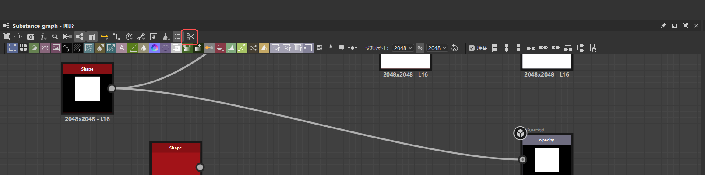

# Node Cut

**给 Substance 3D Designer 补上 `Ctrl+X` 剪切。**

[](LICENSE)


[English](README.en.md) · **中文**



Substance 3D Designer 的图形视图没有剪切命令，`Ctrl+X` 按下去没反应，
官方的快捷键设置里也只能绑「创建节点」的键。这个插件把 `Ctrl+X` 变成复制 + 删除。

## 安装

到 [Releases](https://github.com/Ker0el/substance-designer-node-cut/releases) 下载
**`NodeCut-Setup_v1.0.1.exe`** 双击运行，一路「下一步」——**不用选目录**，它自己找位置。

> ⚠️ **装完必须重启 Designer**，插件只在启动的时候加载一次。
>
> 打开任意一个 Substance 图形，工具栏末尾出现剪刀按钮就说明好了。

不想用安装包，也可以把 `plugin/node_cut` 整个文件夹拷到
`%USERPROFILE%\Documents\Adobe\Adobe Substance 3D Designer\python\sduserplugins\`
（拷完应正好是 `...\sduserplugins\node_cut\pluginInfo.json`），或者跑 `python install.py`。

## 使用

| 操作 | 结果 |
|---|---|
| 选中节点 → `Ctrl+X` | 剪切 |
| `Ctrl+V` | 粘贴 |
| `Ctrl+Z` | 一步撤销整个剪切 |
| 重命名节点时 `Ctrl+X` | 还是正常的文本剪切，不会误删节点 |

## 它是怎么做到的

不自己实现复制粘贴，而是**替你按一遍 Designer 自己的 `Ctrl+C` 和 `Delete`**。
所以剪贴板里是 Designer 原生的节点格式 —— `Ctrl+V` 正常粘贴，跨 Designer 实例也行，
撤销行为也和手动删一模一样。Designer 本体一个字节都没改过。

只有在确认 Designer 真的往剪贴板写了东西之后，插件才会按 `Delete`；
复制没成功就**什么都不删**，节点原样保留。

## 卸载

在「设置 - 应用」里卸载即可。手动装的删掉这个文件夹：

```
%USERPROFILE%\Documents\Adobe\Adobe Substance 3D Designer\python\sduserplugins\node_cut\
```

卸载后 Designer 完全不受影响，不需要重装也不需要修复 —— 插件从没改过它的任何文件。

## 出问题

日志在 `...\sduserplugins\node_cut\runtime.log`：

| 日志里看到 | 怎么办 |
|---|---|
| 没有 `initializing` | Designer 没重启，或者 `pluginInfo.json` 的层级放错了（多一层就扫不到） |
| `nothing selected` | 快捷键到了，但先在图形视图里点一下节点 |
| `did not write to the clipboard` | 复制没成功，已取消删除 —— 把日志发到 Issues |

## 兼容性

Windows · Substance 3D Designer 14.1+（测试于 16.0.6）·
只对 Substance 图形生效，函数图和 FX-Map 不接管按键。

## 开发

```
# 离线自测，用 Designer 自带的 Python，不会真的按任何键
"<Designer>\plugins\pythonsdk\python.exe" tools/smoke_test.py

# 打安装包（需要 Inno Setup 6）
cd installer && python stage.py && python mkrtf.py && "ISCC.exe" node_cut.iss
```

`installer/说明.txt` 是安装向导说明页的唯一来源，**别直接编辑 `说明.rtf`**。

## License

[MIT](LICENSE)
